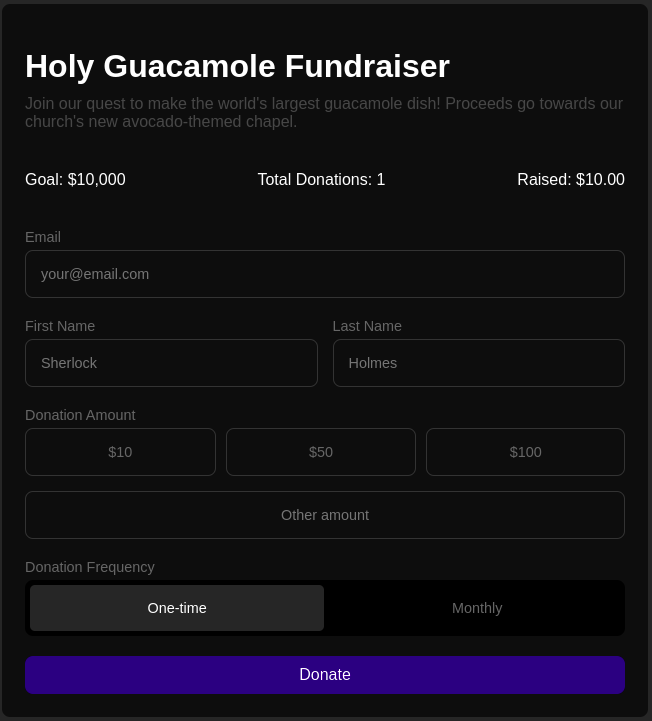

# Donation Form

In this project, I've developed a small library inspired by Stimulus called SimpleComponents. This library manages interactions in HTML pages, allowing for the creation of isolated components that improve code organization and maintainability.

## Example

In your `application.js`:
```js
import { SimpleComponents } from './components/simple_components.js';
import { BaseComponent } from './components/base_component.js';

class AlertComponent extends BaseComponent {
  initialize() {
    // Access the component's element with this.element
    this.element.innerHTML = 'Click here to show the alert';
  }

  showAlert() {
    alert('Hello!');
  }
}

const app = SimpleComponents.new({
  alert: AlertComponent
});

app.load();
```

In your HTML:
```html
<button data-component="alert" data-action-alert="click#showAlert">Show alert</button>
```

With this code, an alert will be displayed when you click the button.

## Demo



A more deeper and complete example can be viewd in this repo. Open the demo [Donation Form](https://pedroaugustofsilva.github.io/donation-form/).

## Documentation

### SimpleComponents init

The first step is to create the app using the `SimpleComponents` class.

```js
import { SimpleComponents } from './components/simple_components.js';
import { ModalComponent } from './components/modal_component.js';

const components = {
  /* Define your component classes to be registered */
  modal: ModalComponent
};

const app = SimpleComponents.new(components);
app.load();
```

This setup facilitates communication between components and manages the application's lifecycle.

### Components, actions and targets

#### Components

To create a component, define a class with the `Component` suffix and extend it from `BaseComponent`:

```js
import { BaseComponent } from './components/base_component.js';

class ModalComponent extends BaseComponent {
  initialize() {
    // This will be called after the component is initialized (loads actions and targets)
  }

  close() {
    this.element.classList.add('hidden');
  }
}

// Register your component
// ...

```
To associate a component with an HTML element, use the `data-component` attribute:

```html
<div data-component="modal">
  My Component
</div>
```

Information:
- Access the component's root element with `this.element`.
- The component name should be a single word.

#### Actions

To use the `close` action defined above, associate it in the HTML:

```html
<div data-component="modal">
  My Component
  <button data-action-modal="click#close">Close modal</button>
</div>
```

Simple!

The attribute value follows the "event#action" format, where the event is any valid event for the element.

#### Targets

You can define targets for specific elements within the component:

```html
<div data-component="modal">
  Errors: <span data-target-modal="errors"></span>
  <button data-action-modal="click#close">Close modal</button>
</div>
```

Access this target with:

```js
class ModalComponent extends BaseComponent {
  initialize() {
    // The convention is targetNameTarget
    this.errorsTarget.innerHTML = 'Invalid email';
  }

  // ..
}
```

If there are multiple targets with the same name, they will be stored in an array suffixed with `Targets`:

```html
<div data-component="modal">
  Errors: <span data-target-modal="errors"></span>

  Options:
  <ul>
    <li data-target-modal="errorOption"></li>
    <li data-target-modal="errorOption"></li>
    <li data-target-modal="errorOption"></li>
  </ul>
  <button data-action-modal="click#close">Close modal</button>
</div>
```

```js
class ModalComponent extends BaseComponent {
  initialize() {
    // Multiple targets are accessed as an array
    this.errorOptionTargets // Array of targets
  }

  // ..
}
```

### Comunication between components

To change the state of another component, use the `notifyComponent` method from the `app`.

For example, suppose you have two components: `MessagesComponent` and `NotificationsComponent`.

Every time you send a message, you want to create a notification:

```js
class NotificationComponent extends BaseComponent {
  newMessage({ message }) {
    alert(`New message: ${message}`);
  }
}

class MessageComponent extends BaseComponent {
  sendMessage() {
    this.app.notifyComponent('notification', 'newMessage', { message: this.messageTarget.innerHTML });
  }
}
```

The `notifyComponent` accepts three arguments:
- The component name;
- THe component action to call;
- And an object with parameters, which is optional.

## And that's all!

This library consists of only 86 lines of code, yet it's impressive how much functionality it provides.

It's important to note that this is a study project inspired by Stimulus, and it is not intended for production use.

Feel free to explore and expand upon this library for learning and development purposes.
